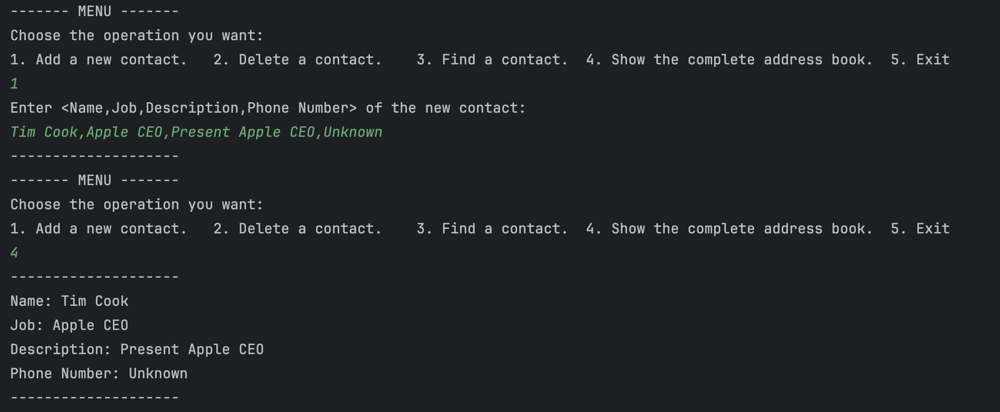
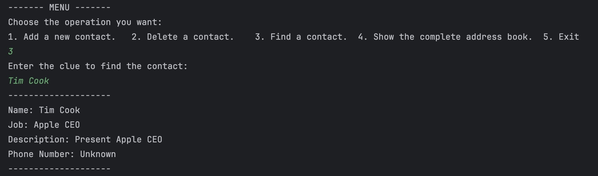
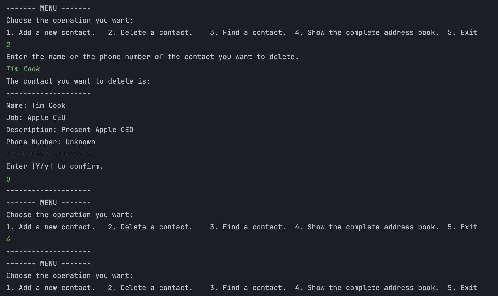

# Address Book

## Description

This is a small exercise developed by C++. It implements a simple address book that includes showing the information of a contact, adding a new contact, deleting an existed contact and finding an existed contact on macOS.

## Effect Preview

### Add a new contact

### Find an existed contact by *NAME* or *PHONE_NUMBER*

### Delete an existed contact

## The method of application

1. Use `cmake` to compile the **CMakeLists.txt**.
2. Use `make` to compile the source file of C++.
3. The **AddressBook** which is generated automatically is the executable file.